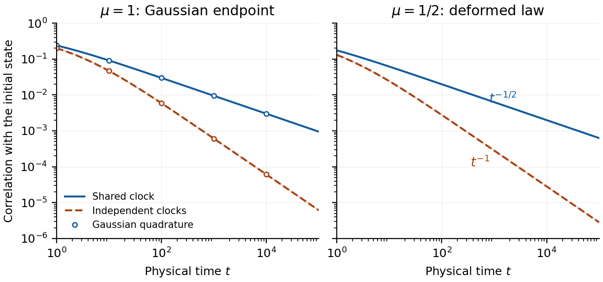

# Collective threshold relaxation

This repository contains the collective-threshold application of the interface spectral chaos construction, together with its theorem and proof, numerical method, reproducible Python code, and reference results.

## Main manuscript and this companion

**Elena Boguslavskaya and Elina Shishkina. _Fractional Wiener chaos: Part 2. Interface spectral chaos and decay of collective correlations._ (2026).**

The paper is available as [arXiv:2609.13971](https://arxiv.org/abs/2609.13971). [Read the PDF](https://arxiv.org/pdf/2609.13971) · [DOI: 10.48550/arXiv.2609.13971](https://doi.org/10.48550/arXiv.2609.13971). As checked on 23 September 2026, the arXiv record lists [version 1](https://arxiv.org/abs/2609.13971v1), submitted on 12 September 2026.

This repository provides the complete companion application, **[Computing the decay of collective threshold correlations](#collective-threshold-correlations)**, with all four subsections, the decay theorem and its proof, the truncation bounds, and the numerical example and figure. The text was transferred from Section 6 of the supplied `v2FWCII_arxiv-FINAL.pdf` (22 September 2026 snapshot, pages 25-29); this local source snapshot is distinct from the version currently listed on arXiv.

Cross-references have been adapted for GitHub: the definitions needed from the paper are repeated, application equations use labels C1-C7, and citations link to a bibliography below. S.1 and S.2 supply the Gaussian benchmark and numerical diagnostics referenced by the application. Cite the arXiv paper for the spectral construction and the repository version used for this companion application. Links to this computation should point to this README, whose labels remain stable across manuscript versions.

**Contents:** [Run the code](#quick-start) · [Tests](#tests) · [Full application](#collective-threshold-correlations) · [Gaussian benchmark (S.1)](#gaussian-benchmark) · [Diagnostics (S.2)](#numerical-diagnostics) · [References](#references) · [Consistency checks](PAPER_CONSISTENCY.md)

The supplied numerical experiment uses two coordinates (`m = 2`), inverse-clock order `tau = 1/2`, deformation parameters `mu = 1, 1/2, 3/7`, and 32 positive modes per coordinate. The figure uses the first two parameters; `mu = 3/7` is an additional nodal interface diagnostic. The theoretical application below treats general `m >= 2` and `0 < tau < 1`. The implementation is the fixed half-stable, two-coordinate example, and its calculations use floating-point arithmetic rather than interval certification.

## Quick start

Download or clone this repository, then open a terminal in its root directory. Use **Python 3.12** for the tested environment.

On macOS or Linux:

```sh
python3.12 -m venv .venv
source .venv/bin/activate
python -m pip install -r requirements.txt
python reproduce.py
```

On Windows, using PowerShell:

```powershell
py -3.12 -m venv .venv
.venv\Scripts\python.exe -m pip install -r requirements.txt
.venv\Scripts\python.exe reproduce.py
```

The script prints a summary and creates `outputs/` inside the repository. Open `outputs/figures/collective_clocks.png` to view the figure, or `outputs/numerical_report.md` for the numerical report.

Only Python, NumPy, SciPy, and Matplotlib are required. No manuscript files, LaTeX installation, external dataset, account, or network connection is needed after installing dependencies. Matplotlib uses the headless `Agg` backend, so a graphical desktop is not required.

## Outputs

Every run overwrites these generated files, all relative to the repository root:

| File | Contents |
| --- | --- |
| `outputs/results.json` | Parameters, versions, spectra, coefficients, diagnostics, benchmarks, amplitudes, and figure metadata |
| `outputs/results.txt` | Concise numerical summary |
| `outputs/numerical_report.md` | Standalone report with benchmark and diagnostic tables and a linked figure |
| `outputs/figures/collective_clocks.pdf` | Vector figure |
| `outputs/figures/collective_clocks.png` | Raster figure |

Output paths are resolved relative to `reproduce.py`, so the script can also be launched from another working directory using its full path. The repository must be writable. Generated outputs are ignored by Git; the original numerical reference in `reference/results.json` is kept separately and is never overwritten by the script.

## Tests

With the virtual environment activated, run:

```sh
python -m unittest -v test_reproduce
```

On Windows without activation:

```powershell
.venv\Scripts\python.exe -m unittest -v test_reproduce
```

The suite runs the complete reproduction in a temporary directory, from a different working directory, and checks:

- Generation of the report, numerical files, and both figure formats inside the standalone folder.
- Gaussian probabilities, spectra, coefficient formulas, and covariance reference values.
- Decreasing truncation errors for `N = 4, 8, 16, 32`, within the estimated remainder bounds.
- Ordered spectra, positive gaps, coefficient mass, interface matching, Gram matrices, and direct coefficient quadrature.
- Cutoff sensitivity and the nodal case `mu = 3/7`.
- Long-time amplitudes and scaled covariance convergence through `t = 1,000,000`.
- Small Gaussian spectra for `N = 1` through `8`, and deformed spectra for `N = 1, 4, 6, 7, 8`.
- Agreement with the parameters and four rounded values in the README's [numerical evaluation](#numerical-evaluation), and a recursive comparison of fresh results with the full stored reference.

Tests preserve both `reference/` and any existing `outputs/`. Temporary outputs are deleted after testing. The numerical tolerances are regression checks rather than certified error bounds.

Validated on 22 September 2026 with Python 3.12.14 on macOS (Apple silicon) and the pinned dependencies: all eleven tests passed, including the documented-application consistency checks and full numerical reproduction, with zero recorded quadrature warnings. Windows and Linux instructions are provided but were not tested in this environment.

## Expected numerical results

For the Gaussian case (`mu = 1`) at `t = 1`:

| Quantity | Shared clock | Independent clocks |
| --- | --- | --- |
| Independent quadrature benchmark | 0.0150734676645 | 0.0125986424004 |
| Absolute error with 32 modes | 1.16519e-4 | 5.93549e-5 |
| Estimated truncation bound | 3.56009e-4 | 2.36452e-4 |

The expected threshold probabilities are approximately `0.5`, `0.696491311248`, and `0.734484032950` for `mu = 1, 1/2, 3/7`, respectively. Successful reference runs record zero quadrature warnings. Small changes in the last digits of numerical diagnostics can occur across platforms.

`reference/results.json` contains the original numerical reference produced with Python 3.12.13, NumPy 2.3.5, SciPy 1.17.0, and Matplotlib 3.10.8. `requirements.txt` pins those three direct numerical dependencies; pip resolves their transitive dependencies. Each fresh run records its actual versions in `outputs/results.json`.

## Main repository files

```text
collective-threshold-relaxation/
├── README.md
├── PAPER_CONSISTENCY.md
├── LICENSE
├── requirements.txt
├── reproduce.py
├── interface_modes.py
├── test_reproduce.py
├── .gitignore
└── reference/
    ├── results.json
    ├── collective_clocks.png
    └── collective_clocks.pdf
```

`reproduce.py` implements the spectral data, covariance sums, Gaussian benchmark, asymptotic coefficients, figure, and report. `interface_modes.py` supplies the reciprocal-Gamma characteristic equation, root scan, interface matching, and half-line mode normalisation. `test_reproduce.py` uses Python's standard `unittest` library, so no additional test framework is required.

## Using the functions

Run this example from the repository root in the activated environment:

```python
from reproduce import spectral_data, covariances, amplitudes

N = 4
spectrum = spectral_data(mu=1.0, N=N)
shared, independent, shared_bound, independent_bound = covariances(
    spectrum, t=[1.0, 100.0, 10000.0], N=N
)
long_time = amplitudes(spectrum, N=N)
```

Pass the same `N` to the consuming functions: their defaults are 32. `N` represents a positive integer count of retained modes. The Gram diagnostic checks up to the first nine available modes, including the ground and first omitted modes; it also works when fewer than nine modes are available.

The complete reproduction has fixed parameters in `main()` and no command-line options. Its benchmark, report, and figure are written for the supplied `m = 2`, `tau = 1/2` experiment.

To rebuild only the Markdown report from the original reference, without recomputing spectra or figures:

```sh
python -c 'import json; from pathlib import Path; from reproduce import write_reports; write_reports(json.loads(Path("reference/results.json").read_text()))'
```

This creates `outputs/numerical_report.md`; its figure link becomes available after a full reproduction run.

## Troubleshooting

- **Missing Python package:** use the same virtual-environment interpreter for installation and execution. `python -m pip check` checks installed dependency compatibility.
- **Output permission error:** move the repository to a writable directory, since outputs are stored beside the script under `outputs/`.
- **Unwritable Matplotlib cache:** set `MPLCONFIGDIR` to a writable directory. For example, on macOS/Linux, run `MPLCONFIGDIR=.matplotlib python reproduce.py`.
- **Numerical differences:** compare the benchmark errors with their bounds and run the tests. Exact byte-for-byte agreement of floating-point results or figure files across platforms is not expected.

<a id="collective-threshold-correlations"></a>

## Computing the decay of collective threshold correlations

<a id="spectral-background"></a>

### Spectral background and notation

The construction and its operator-domain results are developed in Sections 2-5 of the main manuscript. The definitions needed for this application are repeated here so the formulas below do not depend on the manuscript's changing equation numbers.

<a id="interface-spectrum"></a>

Work at Gaussian variance one, with $`\gamma(\mathrm{d}x)=w_1(x)\,\mathrm{d}x`$, $`w_1(x)=(2\pi)^{-1/2}e^{-x^2/2}`$. Let $`e_k^{(\mu)}`$ be the $`L^2(\gamma)`$-normalised interface eigenfunctions, with ordered eigenvalues $`\alpha_k(\mu)`$ and strictly positive ground state $`e_0^{(\mu)}`$. Set $`\lambda_k(\mu)=\alpha_k(\mu)-\alpha_0(\mu)`$, so $`\lambda_0=0`$ and $`\lambda_1\gt 0`$. The branch orders and characteristic equation are

```math
\beta_\mu(\alpha)=\mu\alpha-\frac{1-\mu}{2},\qquad
\Delta_\mu(\alpha)=
\frac{\sqrt\mu}{\Gamma(-\alpha/2)\Gamma((1-\beta_\mu(\alpha))/2)}
+\frac{1}{\Gamma((1-\alpha)/2)\Gamma(-\beta_\mu(\alpha)/2)}=0.
```

<a id="ground-state"></a>

The ground-state transformation defines

**(B1)**

```math
\nu_\mu(\mathrm{d}x)=(e_0^{(\mu)}(x))^2\gamma(\mathrm{d}x),\qquad
r_k^{(\mu)}=\frac{e_k^{(\mu)}}{e_0^{(\mu)}},\qquad
N_\mu r_k^{(\mu)}=\lambda_k(\mu)r_k^{(\mu)},\qquad r_0^{(\mu)}=1.
```

<a id="product-basis"></a>

For a multi-index with finitely many nonzero entries, the product basis and eigenvalues are

**(B2)**

```math
R_{\mathbf k}^{(\mu)}(x)=\prod_j r_{k_j}^{(\mu)}(x_j),\qquad
\Lambda_{\mathbf k}(\mu)=\sum_j\lambda_{k_j}(\mu),\qquad
\mathbf N_\mu R_{\mathbf k}^{(\mu)}=\Lambda_{\mathbf k}(\mu)R_{\mathbf k}^{(\mu)}.
```

These products form the orthonormal basis of $`L^2(\mathbb P_\mu)`$, where $`\mathbb P_\mu=\nu_\mu^{\otimes\mathbb N}`$. Grouping them by the common value of $`\Lambda_{\mathbf k}(\mu)`$ gives the product spectral chaos. A finite-coordinate observation is identified with its cylinder function on this countable product space.

<a id="one-coordinate-evolution"></a>

Here $`E_\tau(z)=\sum_{n\geq0}z^n/\Gamma(1+\tau n)`$ is the Mittag-Leffler function, whereas $`E_t^{(\tau)}`$ denotes an inverse stable clock; the different argument and index distinguish them. For $`0\lt \tau\lt 1`$, the one-coordinate Caputo evolution $`{}^CD_t^\tau u=-N_\mu u/2`$ has spectral multipliers $`E_\tau[-t^\tau\lambda_k(\mu)/2]`$. Its product-space counterpart is stated below. Norms in the application refer to the relevant one-coordinate or product $`L^2`$ probability space.

<a id="observation"></a>

### The observation and its spectral coefficients

We use the [product spectral chaos](#spectral-background) to compute how a collective threshold observation retains correlation with its initial value. The [boundary-flux identity (B3)](#threshold-coefficients) supplies the coefficients, the product eigenvalues $`\Lambda_{\mathbf k}(\mu)`$ from [product basis (B2)](#product-basis) and the product-basis theorem in the main manuscript (Section 3) determine their evolution, and the omitted coefficient mass bounds the truncation error. Shared and independent inverse clocks provide two dynamics to which the same expansion applies.

Fix $`0\lt \mu\leq1`$, $`0\lt \tau\lt 1`$ and an integer $`m\geq2`$. The parameter $`\mu`$ determines the equilibrium law $`\nu_\mu`$ and the eigenfunctions $`r_k^{(\mu)}`$
of $`N_\mu`$; $`\tau`$ determines the inverse stable waiting-time mechanism. For the probability $`p_\mu=\nu_\mu((0,\infty))`$, define the centred threshold and its collective product by

```math
f(x)=\mathbf{1}_{(0,\infty)}(x)-p_\mu,\qquad
F(x_1,\ldots,x_m)=\prod_{j=1}^m f(x_j).
```

The value $`f(x)`$ is the observed threshold indicator minus its
equilibrium probability. For $`m=2`$, $`F`$ is positive when both
coordinates are on the same side of the threshold and negative when
they are on opposite sides, with magnitudes determined by $`p_\mu`$.
Its correlation with the initial value measures persistence of this
joint fluctuation. More generally, integrating out any coordinate
makes $`F`$ vanish, so centring isolates the contribution involving all
$`m`$ coordinates. We have $`0\lt p_\mu\lt 1`$ and $`\|f\|_{L^2(\nu_\mu)}^2=p_\mu(1-p_\mu)`$.

Let

```math
f_k=\langle f,r_k^{(\mu)}\rangle_{L^2(\nu_\mu)},
```

where
$`r_k^{(\mu)}=e_k^{(\mu)}/e_0^{(\mu)}`$
are the normalised eigenfunctions of $`N_\mu`$
defined in [ground-state transformation (B1)](#ground-state).
Since $`r_0^{(\mu)}=1`$ and $`f`$ has mean zero,
$`f_0=0`$. Subtracting $`p_\mu`$ leaves the coefficients of eigenfunctions corresponding to positive eigenvalues unchanged. The [boundary-flux identity (B3)](#threshold-coefficients) therefore gives

<a id="threshold-coefficients"></a>

**(B3)**

```math
f_k=\frac{w_1(0)}{\lambda_k(\mu)}
\left[e_0^{(\mu)}(0)(e_k^{(\mu)})'(0)-(e_0^{(\mu)})'(0)e_k^{(\mu)}(0)\right],\qquad k\geq1.
```

Once the eigenfunctions have been normalised, this identity gives every coefficient from the interface data, including those of eigenfunctions vanishing at the interface. The discontinuous datum belongs to $`L^2(\nu_\mu)`$ but not to the gradient domain; the spectral evolution below is consequently understood in the mild sense. Its expansion is infinite even at the Gaussian endpoint; see [S.1: Gaussian coefficients and independent benchmark](#gaussian-benchmark) for the explicit Gaussian coefficients.

Let $`X_1,\ldots,X_m`$ be independent diffusions with generator $`(-N_\mu/2)`$, initially distributed according to $`\nu_\mu^{\otimes m}`$. Independently of these diffusions, take an inverse stable clock $`E_t^{(\tau)}`$ and independent copies $`E_t^{(\tau,j)}`$, $`1\leq j\leq m`$. Evaluate all coordinates at $`E_t^{(\tau)}`$ for the shared model and coordinate $`j`$ at $`E_t^{(\tau,j)}`$ for the independent model. Define their initial-state covariances by

<a id="covariances"></a>

**(C1)**

```math
\begin{aligned}
C_{\rm sh}(t)&=\mathbb{E}\prod_{j=1}^m f(X_j(0))f(X_j(E_t^{(\tau)})),\\
C_{\rm ind}(t)&=\mathbb{E}\prod_{j=1}^m f(X_j(0))f(X_j(E_t^{(\tau,j)})).
\end{aligned}
```

Division by $`[p_\mu(1-p_\mu)]^m`$ gives the threshold correlation coefficients. Conditioning on the clocks shows that both vectors have law $`\nu_\mu^{\otimes m}`$ at every fixed time, and their full one-coordinate process laws agree. The shared clock couples their histories. These fixed-time statements do not imply stationarity of the time-changed processes.

<a id="product-chaos-evolution"></a>

### Evolution in the product chaos

The calculation applies to any nonzero real centred $`f\in L^2(\nu_\mu)`$, with $`F{\,=\,}\prod_{j=1}^m f(x_j)`$ and [covariances (C1)](#covariances).  For $`\mathbf k\in\mathbb{N}_0^m`$, the [product basis](#product-basis) gives

```math
F_{\mathbf k}=\prod_{j=1}^m f_{k_j},\qquad
F_{\mathbf k}=0\ \text{if any }k_j=0,\qquad
\sum_{\mathbf k}|F_{\mathbf k}|^2=\|f\|_2^{2m}.
```

These are cylinder functions in the constructed countable product space. A product eigenfunction $`R_{\mathbf k}^{(\mu)}`$ has eigenvalue $`\Lambda_{\mathbf k}(\mu)=\sum_{j=1}^m\lambda_{k_j}(\mu)`$; the number of active coordinates is distinct from this eigenvalue label.

Write $`u_{\rm sh}(t,x)`$ and $`u_{\rm ind}(t,x)`$  for the expected terminal value of $`F`$ starting from $`x`$. Conditional independence and the scalar clock transform yield

<a id="product-evolutions"></a>

**(C2)**

```math
\begin{aligned}
u_{\rm sh}(t)&=\sum_{\mathbf k}F_{\mathbf k}
E_\tau[-t^\tau\Lambda_{\mathbf k}(\mu)/2]R_{\mathbf k}^{(\mu)},\\
u_{\rm ind}(t)&=\sum_{\mathbf k}F_{\mathbf k}
\prod_{j=1}^m E_\tau[-t^\tau\lambda_{k_j}(\mu)/2]R_{\mathbf k}^{(\mu)}.
\end{aligned}
```

All multipliers lie in $`[0,1]`$. Parseval therefore extends these formulas from bounded data to arbitrary $`F\in L^2(\nu_\mu^{\otimes m})`$, using its spectral coefficients $`F_{\mathbf k}`$.  By the product version of the [one-coordinate Caputo solution](#one-coordinate-evolution),
the shared evolution is the unique bounded continuous
$`L^2`$-valued mild solution of

<a id="product-caputo"></a>

**(C3)**

```math
{}^CD_t^\tau u(t)=-\tfrac12\mathbf N_\mu u(t),
\qquad u(0)=F.
```

The independent evolution agrees with the shared
evolution for observations depending on only one
coordinate. For $`0\lt \tau\lt 1`$, it generally does not
solve [product Caputo equation (C3)](#product-caputo) on product
eigenfunctions containing two or more nonconstant factors.

For the product datum, taking the inner product with $`F`$ reduces the collective computation to

<a id="covariance-series"></a>

**(C4)**

```math
\begin{aligned}
C_{\rm sh}(t)&=\sum_{k_1,\ldots,k_m\geq1}
\left(\prod_{j=1}^m|f_{k_j}|^2\right)
E_\tau\left[-\frac{t^\tau}{2}\sum_{j=1}^m\lambda_{k_j}(\mu)\right],\\
C_{\rm ind}(t)&=\left[\sum_{k\geq1}|f_k|^2
E_\tau[-t^\tau\lambda_k(\mu)/2]\right]^m.
\end{aligned}
```

The coefficients already computed at the interface are thus sufficient for every $`t\geq0`$. A shared clock acts on the sum of coordinate eigenvalues; independent clocks multiply the coordinate decay factors. This is an established inverse-clock mechanism ([Beghin, Macci and Ricciuti](#ref-beghin), Sections 1 and 4); the construction here supplies the eigenfunctions and coefficients for the non-Gaussian interface family.

<a id="decay-theorem"></a>

**Theorem (Decay of collective correlations).**
For $`0\lt \mu\leq1`$, $`0\lt \tau\lt 1`$, integers $`m\geq2`$ and nonzero real $`f\in L^2(\nu_\mu)`$, such that

```math
\int_{-\infty}^\infty f(x)\nu_\mu(\mathrm{d}x)=0
```

we have

```math
0\lt C_{\rm ind}(t)\lt C_{\rm sh}(t)\leq\|f\|_2^{2m},\qquad t\gt 0.
```

The finite positive long-time limits are

<a id="long-time-limits"></a>

**(C5)**

```math
\begin{aligned}
\lim_{t\to\infty}t^\tau C_{\rm sh}(t)
&=\frac2{\Gamma(1-\tau)}
\sum_{k_1,\ldots,k_m\geq1}
\frac{\prod_{j=1}^m|f_{k_j}|^2}{\sum_{j=1}^m\lambda_{k_j}(\mu)},\\
\lim_{t\to\infty}t^{m\tau}C_{\rm ind}(t)
&=\left[\frac2{\Gamma(1-\tau)}
\sum_{k\geq1}\frac{|f_k|^2}{\lambda_k(\mu)}\right]^m.
\end{aligned}
```

The proof uses the one-coordinate covariance at deterministic time.
With a shared clock, we first take its $`m`$th power and then average
over the clock. With independent clocks, we first average and then
take the power. Convexity compares these quantities, and the spectral
gap controls their long-time limits.

**Proof.**
For deterministic operational time $`s`$, the one-coordinate covariance
$`c(s)=\langle e^{-sN_\mu/2}f,f\rangle=\sum_{k\geq1}|f_k|^2e^{-s\lambda_k(\mu)/2}`$
is positive and strictly decreasing. Conditioning gives

```math
C_{\rm sh}(t)=\mathbb{E}[c(E_t^{(\tau)})^m],\qquad
C_{\rm ind}(t)=[\mathbb{E} c(E_t^{(\tau)})]^m.
```

Invariance and Cauchy–Schwarz bound each absolute one-coordinate expectation by $`\|f\|_2^2`$, so these identities hold for the stated $`L^2`$ data. Tonelli gives [covariance series (C4)](#covariance-series); strict Jensen gives the comparison because the clock is nondegenerate for $`t\gt 0`$ ([Meerschaert and Straka](#ref-meerschaert), Sections 2-3).

For $`a\gt 0`$, complete monotonicity and the Laplace transform $`p^{\tau-1}/(p^\tau+a)`$ give

<a id="mittag-leffler-asymptotics"></a>

**(C6)**

```math
\lim_{t\to\infty}t^\tau E_\tau(-at^\tau)=\frac1{a\Gamma(1-\tau)},\qquad
0\leq t^\tau E_\tau(-at^\tau)\leq\frac1{a(1-e^{-1})}.
```

For the limit, apply the monotone density Tauberian theorem ([Bingham, Goldie and Teugels](#ref-bingham), Sections 1.7.2-1.7.3) to this nonnegative nonincreasing function and its transform at zero. For the bound, monotonicity implies

```math
t(1-e^{-1})E_\tau(-at^\tau)
\leq\int_0^\infty e^{-s/t}E_\tau(-as^\tau)\,\mathrm{d} s
=\frac{t}{1+at^\tau}.
```

In [covariance series (C4)](#covariance-series), the positive gap bounds the relevant denominators below by $`m\lambda_1(\mu)`$ and $`\lambda_1(\mu)`$, respectively. The total coefficient mass is $`\|f\|_2^{2m}`$, so [Mittag-Leffler asymptotics (C6)](#mittag-leffler-asymptotics) and dominated convergence prove [long-time limits (C5)](#long-time-limits). A nonzero coefficient makes each limit strictly positive.
$`\square`$

At $`m=1`$ the two covariances agree. They also agree at $`\tau=1`$, when the clock is deterministic and the exponential of the sum of coordinate eigenvalues $`\lambda_{k_j}(\mu)`$ factors. The displayed asymptotics concern fixed $`\tau\lt 1`$ and are not uniform at that endpoint.

<a id="truncating-expansion"></a>

### Truncating the collective expansion

To compute [covariance series (C4)](#covariance-series), retain $`1\leq k_j\leq N`$ in the shared sum and $`1\leq k\leq N`$ in the independent one-coordinate sum, giving $`C_{{\rm sh},N}`$ and $`C_{{\rm ind},N}`$. All omitted terms are nonnegative. Their total mass and smallest possible eigenvalue $`\lambda_{k_j}(\mu)`$ yield

<a id="truncation-bounds"></a>

**(C7)**

```math
\begin{aligned}
0\leq C_{\rm sh}(t)-C_{{\rm sh},N}(t)
\leq{}&E_\tau\left[-\frac{t^\tau}{2}
\bigl(\lambda_{N+1}(\mu)+(m-1)\lambda_1(\mu)\bigr)\right]\\
&\quad\times\left[\|f\|_2^{2m}-
\left(\sum_{k=1}^N|f_k|^2\right)^m\right],\\
0\leq C_{\rm ind}(t)-C_{{\rm ind},N}(t)
\leq{}&m\|f\|_2^{2(m-1)}E_\tau[-t^\tau\lambda_1(\mu)/2]^{m-1}\\
&\quad\times E_\tau[-t^\tau\lambda_{N+1}(\mu)/2]\left[\|f\|_2^2-\sum_{k=1}^N|f_k|^2\right].
\end{aligned}
```

For the first bound, an omitted multi-index has one coordinate exceeding $`N`$ and all other coordinates positive. For the second, bound the omitted one-coordinate sum and use $`a^m-b^m\leq m a^{m-1}(a-b)`$, where $`a`$ and $`b`$ are the full and truncated sums; here $`a\leq\|f\|_2^2E_\tau[-t^\tau\lambda_1(\mu)/2]`$. Monotonicity of the multipliers and Parseval identity prove both bounds and uniform convergence of the increasing approximations for $`t\geq0`$.

For threshold data, insert $`\|f\|_2^2=p_\mu(1-p_\mu)`$ and the interface coefficients. The constants in [long-time limits (C5)](#long-time-limits) have corresponding bounds: for the shared constant, multiply its omitted coefficient mass by $`2/[\Gamma(1-\tau)(\lambda_{N+1}(\mu)+(m-1)\lambda_1(\mu))]`$; for the independent constant, the omitted one-coordinate sum before taking its $`m`$th power is at most

```math
\frac{2}{\Gamma(1-\tau)\lambda_{N+1}(\mu)}
\left[\|f\|_2^2-\sum_{k=1}^N|f_k|^2\right].
```

These bounds use the exact spectrum and coefficients. Floating-point evaluations estimate their right-hand sides; they do not certify uncertainty in the numerical inputs.

<a id="numerical-evaluation"></a>

### Numerical evaluation of threshold correlations

We evaluate the threshold series for $`m=2`$, $`\tau=1/2`$, at the Gaussian endpoint $`\mu=1`$ and the deformed law $`\mu=1/2`$. The identity $`E_{1/2}(-z)=e^{z^2}\mathrm{erfc}(z)=\mathrm{erfcx}(z)`$ for $`z\geq0`$ permits stable evaluation.

The numerical calculation determines the roots $`\alpha_k(\mu)`$ of the characteristic equation $`\Delta_\mu(\alpha)=0`$ from the [characteristic equation](#interface-spectrum), the $`L^2(\gamma)`$-normalised eigenfunctions $`e_k^{(\mu)}`$ of the interface spectral theorem in the main manuscript (Section 2), and the coefficients $`f_k`$ from the [boundary-flux identity (B3)](#threshold-coefficients), using SciPy ([Virtanen et al.](#ref-scipy)). See [S.1](#gaussian-benchmark) for the independent Gaussian benchmark and [S.2](#numerical-diagnostics) for the complete procedure, truncation table, and interface diagnostics.

<a id="collective-figure"></a>



**Figure C1.** Collective threshold correlations for $`m=2`$, $`\tau=1/2`$. Solid and dashed curves use a shared clock and independent clocks, respectively. The slower common-clock decay occurs at both the Gaussian and deformed parameters. Bands are floating-point estimates of the analytical truncation bounds. [Vector PDF](reference/collective_clocks.pdf).

The curves and bands are divided by $`[p_\mu(1-p_\mu)]^2`$; the implementation retains $`N=32`$ positive modes per coordinate and plots $`1\leq t\leq10^5`$.

At $`t=1`$ and $`\mu=1`$, the absolute covariance errors are $`1.17\times10^{-4}`$ (shared) and $`5.94\times10^{-5}`$ (independent), within the estimated bounds $`3.56\times10^{-4}`$ and $`2.36\times10^{-4}`$, respectively. [S.2](#numerical-diagnostics) reports the dependence on the number of retained eigenfunctions and the numerical diagnostics.

The expansion of the collective observation $`F`$ in the product eigenfunctions $`R_{\mathbf k}^{(\mu)}`$ defined in [product basis (B2)](#product-basis) reduces the correlation calculation to the scalar Mittag–Leffler factors in [covariance series (C4)](#covariance-series). The [truncation bounds (C7)](#truncation-bounds) control the contribution of the omitted terms. The gradient and divergence construct the conservative number operator, but this computation needs only its self-adjoint spectral realisation. The decay-rate distinction also holds for other reversible diffusions with a spectral gap; here it accompanies a computable non-Gaussian example of the constructed product chaos.

<a id="gaussian-benchmark"></a>

### S.1. Gaussian coefficients and independent benchmark

At $`\mu=1`$, the equilibrium law is standard Gaussian, $`p_1=1/2`$, and the modes are $`r_k^{(1)}=\mathrm{He}_k/\sqrt{k!}`$. The threshold datum is $`f(x)=\mathbf{1}_{(0,\infty)}(x)-1/2`$. The [boundary-flux identity (B3)](#threshold-coefficients) gives

<a id="gaussian-weights"></a>

**(S1)**

```math
f_{2n}=0\quad(n\geq1),\qquad
|f_{2n+1}|^2=\frac{1}{2\pi}\frac{\binom{2n}{n}}{4^n(2n+1)}\quad(n\geq0).
```

Indeed $`e_0=1`$, $`e_0'=0`$ and $`\lambda_k=k`$, while
$`\mathrm{He}_k'=k\mathrm{He}_{k-1}`$ and
$`\mathrm{He}_{2n}(0)=(-1)^n(2n)!/(2^nn!)`$.
These identities give [Gaussian weights (S1)](#gaussian-weights) directly and show that infinitely many coefficients are nonzero. The code compares these weights with those obtained from the interface calculation.

For a benchmark that uses no interface roots, take independent standard normals $`Z_1,V`$ and set $`Z_2=\rho Z_1+\sqrt{1-\rho^2}V`$, with $`-1\lt \rho\lt 1`$. The joint positivity event is a sector of angle $`\pi/2+\arcsin\rho`$ in the rotationally symmetric $`(Z_1,V)`$ plane. Subtracting the product of the marginal probabilities gives

```math
\mathrm{Cov}(\mathbf{1}_{\{Z_1\gt 0\}},\mathbf{1}_{\{Z_2\gt 0\}})
=\frac{\arcsin\rho}{2\pi}.
```

The endpoint cases follow by continuity. For stationary Ornstein–Uhlenbeck motion generated by $`-N_1/2`$, the correlation at operational time $`s`$ is $`e^{-s/2}`$. An inverse half-stable clock has density $`e^{-s^2/(4t)}/\sqrt{\pi t}`$ for $`s\gt 0`$ ([Meerschaert and Straka](#ref-meerschaert), Section 2). Conditioning therefore gives, for $`m=2`$ and $`t\gt 0`$,

<a id="gaussian-quadratures"></a>

**(S2)**

```math
\begin{aligned}
C_{\rm sh}(t)&=\frac1{\sqrt{\pi t}}\int_0^\infty
\left[\frac{\arcsin(e^{-s/2})}{2\pi}\right]^2e^{-s^2/(4t)}\,\mathrm{d} s,\\
C_{\rm ind}(t)&=\left[\frac1{\sqrt{\pi t}}\int_0^\infty
\frac{\arcsin(e^{-s/2})}{2\pi}e^{-s^2/(4t)}\,\mathrm{d} s\right]^2.
\end{aligned}
```

These quadratures supply the Gaussian points in [Figure C1](#collective-figure) and the reference values for [the truncation table](#truncation-table) below.

The independent long-time coefficient is exactly $`(\log2)^2/(4\pi)`$. To see this, substitute $`y=e^{-s/2}`$ and integrate by parts:

```math
\int_0^\infty\arcsin(e^{-s/2})\,\mathrm{d} s
=2\int_0^1\frac{\arcsin y}{y}\,\mathrm{d} y
=-2\int_0^{\pi/2}\log(\sin\theta)\,\mathrm{d}\theta
=\pi\log2.
```

For the last equality, symmetry replaces $`\sin\theta`$ by $`\cos\theta`$; adding the two integrals and substituting $`2\theta`$ gives their common value $`-(\pi/2)\log2`$. Dominated convergence in [Gaussian quadratures (S2)](#gaussian-quadratures) then gives the coefficient, checking the factors of two in [long-time limits (C5)](#long-time-limits).

<a id="numerical-diagnostics"></a>

### S.2. Reproducible procedure and numerical diagnostics

1. At `mu = 1`, use the exact integer spectrum. For the deformed parameters, scan the characteristic determinant on 12,001 points and refine sign changes with Brent iteration. Include the ground mode, 32 positive modes, and the first omitted mode. The nodal interface case is retained.
2. Evaluate parabolic-cylinder functions by recurrence from nonpositive orders. Normalise modes with half-line quadrature to cutoff 24, and check the first nine-mode Gram matrix, matching residuals, and direct versus boundary-flux threshold coefficients. Repeat at cutoff 18 for `mu = 1/2`.
3. Evaluate the half-stable clock multiplier as `erfcx(lambda * sqrt(t) / 2)`. Use sums of product energies for the shared clock and multiply one-coordinate responses for independent clocks.
4. Compare Gaussian covariances against operational-time integration of the exact arcsine threshold covariance and inverse half-stable density. This benchmark does not use the cylinder functions or root scan.
5. Plot normalised covariances over `1 <= t <= 100000` for `mu = 1` and `mu = 1/2`. Record scaled long-time checks through `t = 1000000` for all three parameters.

Both plotted covariances are divided by `[p_mu * (1 - p_mu)]^2`. Shared-clock covariances decay as `t^(-1/2)`; independent-clock covariances decay as `t^(-1)`. The exact Gaussian independent-clock amplitude is `(log(2))^2 / (4*pi)`.

The shaded bands account for omitted spectral contributions using approximate numerical inputs. They do not enclose errors in roots, special functions, or quadrature. Root completeness is not certified. The code supports numerical reproduction of the research calculation, not a replacement for its analytical proofs.

The exact nodal case $`\mu=3/7`$, $`\alpha=3`$, $`\beta_\mu(\alpha)=1`$ checks $`B_{3,1}=3\sqrt\mu\,A_{3,1}`$. Modes vanishing on both sides of the interface are retained. The code checks normalisation, matching, and coefficient quadrature; these checks do not certify completeness of the root scan.

<a id="truncation-table"></a>

**Gaussian benchmark at $`t=1`$.** Absolute covariance errors of the partial sums, compared with [the truncation bounds (C7)](#truncation-bounds). The independent benchmark is [the Gaussian quadrature (S2)](#gaussian-quadratures). All entries are unnormalized covariances.

| N | Shared error | Shared bound | Independent error | Independent bound |
| --- | --- | --- | --- | --- |
| 4 | 1.96e-03 | 5.02e-03 | 1.25e-03 | 4.17e-03 |
| 8 | 8.06e-04 | 2.28e-03 | 4.68e-04 | 1.71e-03 |
| 16 | 3.12e-04 | 9.30e-04 | 1.68e-04 | 6.47e-04 |
| 32 | 1.17e-04 | 3.56e-04 | 5.94e-05 | 2.36e-04 |

The largest recorded first-nine-mode Gram discrepancy is `1.28e-9`; the largest coefficient discrepancy over the retained modes is `2.57e-12`. Changing the integration cutoff from 24 to 18 at `mu = 1/2` changes the retained coefficients by at most `9.69e-12`. At `mu = 1/2`, the shared and independent long-time amplitudes have partial sums `0.0088730` and `0.0126247`, with estimated omitted contributions at most `2.02e-4` and `1.16e-4`, respectively. The stored output also includes scaled covariances through `t = 1,000,000`.

The parameter choices, rounded results, covariance normalization, and full stored reference are checked by the test suite. [PAPER_CONSISTENCY.md](PAPER_CONSISTENCY.md) records the numerical comparison and the mapping from the old manuscript equation numbers to the stable README labels. The archived figure in `reference/` displays the supplied reference calculation; a new run writes its figure under `outputs/figures/`.

<a id="references"></a>

## References

The references below are those used in the transferred application and its Gaussian benchmark. Section references refer to the cited works, not to the former numbering of the main manuscript.

<a id="ref-beghin"></a>

- Beghin, L., Macci, C., Ricciuti, C. (2020). Random time-change with inverses of multivariate subordinators: governing equations and fractional dynamics. *Stochastic Processes and their Applications* **130**, 6364-6387. [doi:10.1016/j.spa.2020.05.014](https://doi.org/10.1016/j.spa.2020.05.014).

<a id="ref-bingham"></a>

- Bingham, N. H., Goldie, C. M., Teugels, J. L. (1987). *Regular Variation*. Cambridge University Press. [doi:10.1017/CBO9780511721434](https://doi.org/10.1017/CBO9780511721434).

<a id="ref-meerschaert"></a>

- Meerschaert, M. M., Straka, P. (2013). Inverse stable subordinators. *Mathematical Modelling of Natural Phenomena* **8**(2), 1-16. [doi:10.1051/mmnp/20138201](https://doi.org/10.1051/mmnp/20138201).

<a id="ref-scipy"></a>

- Virtanen, P., Gommers, R., Oliphant, T. E., et al. (2020). SciPy 1.0: fundamental algorithms for scientific computing in Python. *Nature Methods* **17**, 261-272. [doi:10.1038/s41592-019-0686-2](https://doi.org/10.1038/s41592-019-0686-2).

## License

MIT License. See [LICENSE](LICENSE).
